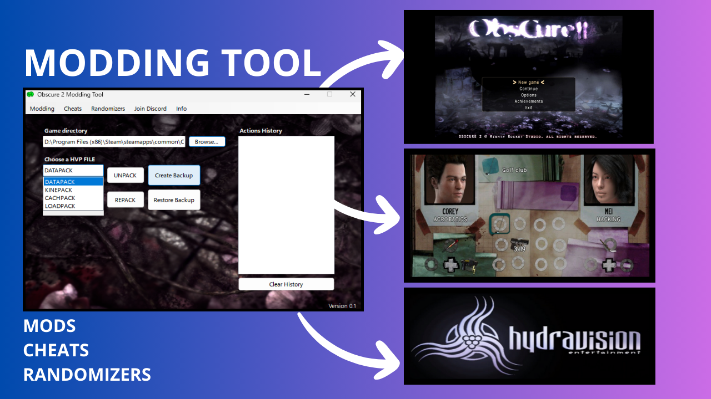

## Join our Discord! [DISCORD HERE](https://discord.gg/NUEZQU64FN)
## NexusMods link [HERE](https://www.nexusmods.com/obscure2/mods/2)

---

### Allows you to:
- Easily unpack/repack hvp files and manually mod the game (instructions inside the tool folder)
- Create and Restore backup of the hvp files
- Enable/Disable pre-existing mods
- Enable/Disable pre-existing cheats
- Enable/Disable pre-existing randomizers

---

### Check the tool's folder to find:
- **Cheat Engine**: character and coordinates swap trainer [Video here](https://youtu.be/SZkCMnZR5OE?si=izbpLl_kFk0xL5AA)
- **Redist**
- **Instructions** on how to manually mod the game

---

### Mods available for now:
- Wii main Menu
- Wii Inventory layout
- Hydravision Intro

### Cheats available for now:
- Save Everywhere

### Randomizers available for now:
- Enemy Randomizer easy/hard mode (NOT READY W.I.P)

---

### How to install:
1. Extract the folder where you want
2. Open the program and browse the game location
3. Ready to go!

---

### Please report any bug on YouTube/NexusMods/Discord.
Post any suggestion on the "Forum" tab on NexusMods by replying.

---

## Join our Discord! [DISCORD HERE](https://discord.gg/NUEZQU64FN)
## NexusMods link [HERE](https://www.nexusmods.com/obscure2/mods/2)
